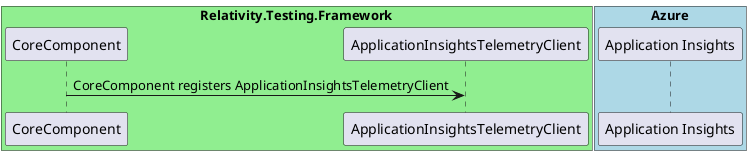

# Relativity.Testing.Framework Interceptors Sequence Diagram

```plantuml
@startuml Relativity.Testing.Framework Interceptors Sequence Diagram

box "Relativity.Testing.Framework" #LightGreen
participant "CoreComponent"
participant "ApplicationInsightsTelemetryClient"
end box

box "Azure" #LightBlue
participant "Application Insights"
end box

"CoreComponent" -> "ApplicationInsightsTelemetryClient" : CoreComponent registers ApplicationInsightsTelemetryClient

@enduml
```
